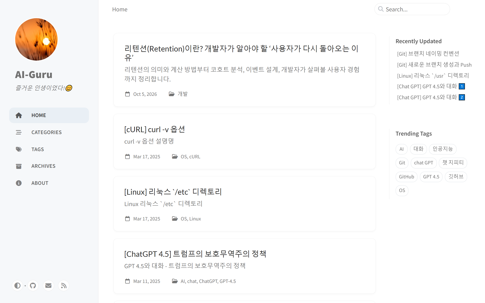
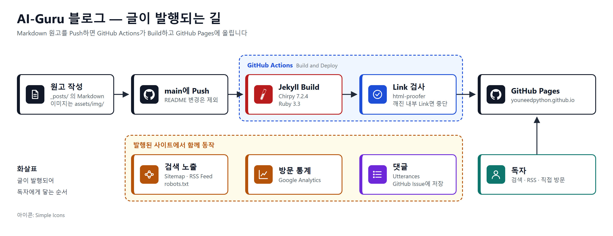

# AI-Guru 기술 블로그

**AI, Git, 백엔드 개발을 공부하며 정리한 글을 올리는 개인 기술 블로그**

Markdown으로 쓴 글을 이 저장소에 Push하면 GitHub Actions가 사이트를 만들어 GitHub Pages에 올립니다.
게시글 원고와 이미지, 사이트 설정을 이곳에서 관리합니다.



| | |
|---|---|
| 주소 | <https://youneedpython.github.io/> |
| 글 | 24편 (2025-02-12 ~ 2026-10-05) |
| 분류 | AI · Tech · 개발 · Github blog · OS |
| Theme | Jekyll + [Chirpy](https://github.com/cotes2020/jekyll-theme-chirpy) 7.2.4 |
| 배포 | GitHub Actions → GitHub Pages |

**더 읽기**: [블로그](https://youneedpython.github.io/) · [Wiki](https://github.com/youneedpython/youneedpython.github.io/wiki)

---

## 글 분류

| 분류 | 글 수 | 다루는 내용 | 예 |
|---|---|---|---|
| AI | 7 | Claude, ChatGPT와 나눈 대화와 사용 경험 | GPT의 답변이 느려지는 이유?, 현재 AI 발전 수준은 어느 단계일까? |
| Tech | 6 | Git과 GitHub 사용법 | 깃 커밋 컨벤션, 브랜치 네이밍 컨벤션, Fork 연결 해제 |
| 개발 | 5 | Spring Boot, Apache, CI / CD, 서비스 개발 개념 | 프로파일별 `yml` 적용, 기업들의 CI/CD 배포 전략, 리텐션이란? |
| Github blog | 3 | 이 블로그를 만들고 꾸민 과정 | Utterances 댓글 위젯 연동하기 |
| OS | 3 | Linux 디렉토리, cURL | `/etc` 디렉토리, `curl -v` 옵션 |

글 수는 2026-10-07에 `_posts/`의 첫 번째 분류를 기준으로 셌습니다.

---

## 주요 기능

### 1. 글 찾기

- 분류(Categories), Tag, 작성 시기(Archives)별 목록과 검색을 제공합니다.
- 글마다 목차가 오른쪽에 표시됩니다.
- 밝은 화면과 어두운 화면을 바꿀 수 있습니다.

### 2. 댓글

- 글 아래에 Utterances 댓글 창이 있습니다. GitHub 계정으로 댓글을 답니다.
- 댓글은 이 저장소의 Issue로 저장됩니다. 따로 운영하는 Database가 없습니다.
- 자세한 내용: [GitHub Blog에 Utterances 댓글 위젯 연동하기](https://youneedpython.github.io/posts/comments-widget/)

### 3. 검색 노출과 방문 통계

- Sitemap과 RSS Feed를 자동으로 만들고, `robots.txt`로 검색 엔진의 수집을 허용합니다.
- Google Search Console 인증과 Google Analytics를 설정했습니다.

---

## 글은 어떻게 발행되나요?



| 단계 | 하는 일 |
|---|---|
| 1. 원고 작성 | `_posts/`에 `YYYY-MM-DD-제목.md` 파일을 만들고, 이미지는 `assets/img/날짜/`에 둡니다 |
| 2. Push | `main`에 Push합니다. `README.md`, `LICENSE`, `.gitignore`만 바뀐 Push는 배포하지 않습니다 |
| 3. Build | GitHub Actions가 Jekyll로 사이트를 만듭니다 |
| 4. Link 검사 | html-proofer가 사이트 안의 Link와 이미지 경로를 검사합니다. 깨진 곳이 있으면 배포하지 않습니다 |
| 5. 배포 | 검사를 통과한 사이트를 GitHub Pages에 올립니다 |

4단계 덕분에 없는 이미지를 가리키는 글은 사이트에 올라가지 않습니다. 실제로 이미지 경로가 틀려 배포가 멈춘 적이 있습니다.

## 기술 스택

| 영역 | 기술 |
|---|---|
| 사이트 생성 | Jekyll, Chirpy Theme 7.2.4, Ruby 3.3 |
| Plugin | jekyll-sitemap, jekyll-feed |
| 댓글 | Utterances |
| 배포 | GitHub Actions, GitHub Pages |
| 검사 | html-proofer |

## 품질 검증

| 검증 | 내용 |
|---|---|
| Build | Push마다 GitHub Actions가 `JEKYLL_ENV=production`으로 사이트를 생성 |
| Link 검사 | html-proofer로 사이트 안의 Link와 이미지 경로 확인 (외부 주소는 검사하지 않음) |

---

## 시작하기

Ruby `3.1` 이상과 Bundler가 필요합니다.

```bash
bundle install
bundle exec jekyll serve          # http://127.0.0.1:4000
```

새 글은 `_posts/`에 아래 형식으로 시작합니다.

```yaml
---
title: "글 제목"
description: "목록에 보이는 한 줄 설명"
date: 2026-10-05 15:30:00 +0900
categories: [개발]
tags: [리텐션, Retention]
---
```

2026-10-07 문서 정리 때 Local 실행은 다시 확인하지 않았습니다. 글 쓰는 규칙과 발행 과정은 [Wiki](https://github.com/youneedpython/youneedpython.github.io/wiki)에 있습니다.

---

## 프로젝트 구조

```text
youneedpython.github.io/
├── _posts/                 게시글 원고 (Markdown)
├── assets/img/             게시글 이미지 (날짜별 폴더), 프로필 이미지, Favicon
├── _tabs/                  Categories, Tags, Archives, About 쪽
├── _config.yml             사이트 제목, 주소, 검색 · 통계 설정
├── robots.txt              검색 엔진 수집 규칙
├── .github/workflows/      Build와 배포 Workflow
│
│   아래는 Chirpy Theme의 파일
├── _layouts/  _includes/  _sass/  _javascript/  _data/  _plugins/
├── docs/  tools/
└── Gemfile  jekyll-theme-chirpy.gemspec  package.json
```

Theme 파일 중 직접 고친 것은 댓글 창을 넣은 `_layouts/post.html`, RSS 정보를 넣은 `_includes/head.html`, 표 모양을 추가한 `_sass/custom.scss`입니다.

## License

Theme은 Cotes Chung의 [Chirpy](https://github.com/cotes2020/jekyll-theme-chirpy)이며 [MIT License](LICENSE)를 따릅니다. 게시글의 내용과 이미지의 저작권은 글쓴이에게 있습니다.
