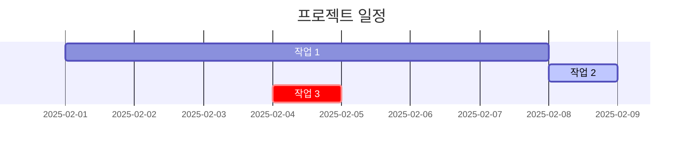

Jekyll 테마 중 하나인 **Chirpy**는 다양한 텍스트와 타이포그래피 기능을 제공한다.   
이 글은 **Chirpy 웹 페이지** 내용을 참고하여 정리하였으며, 부족한 내용은 추가하여 작성하였다.  

> **Chirpy** 코드와 웹 사이트는 아래 링크를 클릭하면 확인 가능하다.  
- code : [github](https://github.com/cotes2020/jekyll-theme-chirpy/blob/master/_posts/2019-08-08-text-and-typography.md?plain=1){:target="_blank"}
- web : [https://chirpy.cotes.page/](https://chirpy.cotes.page/posts/text-and-typography){:target="_blank"}  
{: .prompt-info}

<br>

**Chirpy**로 만든 블로그에서 글을 작성하기 위해 만든 파일의 확장자가 **`.md`**로, **`마크다운`** 파일이다.  
그래서 **`마크다운`** 문법을 이해해야 글을 작성할 수 있다.  

이 글은 **`마크다운`** 문법을 초보자도 쉽게 따라할 수 있도록 정리했다.  
<br><br>

---

> **자주하는 질문**  
**`[질문 1] 백틱은 어디에 있나요?`**    
백틱은 키보드 좌측 상단에 있습니다.  
**esc 키** 아래에 **~(틸드)키**에 있습니다. ~(틸드)와 함께 있는 `가 백틱입니다.  
{: .prompt-danger }

## 1. 제목(Header) 🏷️

Markdown에서는 `#` 문자를 사용하여 '제목'을 표현할 수 있다.  
`#`의 개수에 따라 제목의 크기가 달라진다. 🏗️

```markdown
# H1 - 주제목
## H2 - 부제목
### H3 - 소제목
#### H4 - 소제목의 하위
##### H5 - 더 작은 소제목
###### H6 - 가장 작은 소제목
```

**[결과]**  :
# H1 - 주제목  
## H2 - 부제목  
### H3 - 소제목  
#### H4 - 소제목의 하위  
##### H5 - 더 작은 소제목  
###### H6 - 가장 작은 소제목  
<br><br>

---
## 2. 목록(Lists) 📋

### **순서 있는 목록 (Ordered List) 🔢**
단락 앞에 숫자를 입력하면 된다.  
> **`숫자`** 다음에 **`.`**을 입력하고 **`띄어쓰기`**를 해야 한다.  
> 숫자는 1만 사용해도 된다. 알아서 증가한다.
{: .prompt-warning }

```markdown
1. 첫 번째 항목
1. 두 번째 항목
1. 세 번째 항목
```

**[결과]**  :

1. 첫 번째 항목
1. 두 번째 항목
1. 세 번째 항목
<br><br>

### **순서 없는 목록 (Unordered List) 🔘**
순서 없는 목록을 표현할 때 사용한다.  
사용할 수 있는 기호는 **`-, *, +`** 세 개가 있다.
> 단락 앞에 **`-`** 을 입력하고, **`띄어쓰기`**를 해야 한다.
{: .prompt-warning }

```markdown
- 항목 1
  - 하위 항목 1
    - 하위 하위 항목 1
    - 하위 하위 항목 2
  - 하위 항목 2
    - 하위 하위 항목 1
    - 하위 하위 항목 2
- 항목 2
  - 하위 항목 1
  - 하위 항목 2
```

**[결과]**  

- 항목 1
  - 하위 항목 1
    - 하위 하위 항목 1
    - 하위 하위 항목 2
  - 하위 항목 2
    - 하위 하위 항목 1
    - 하위 하위 항목 2
- 항목 2
  - 하위 항목 1
  - 하위 항목 2
<br><br>  

---
## 3. 체크리스트(To-Do List) ✅

```markdown
- [ ] 할 일
  - [x] 작업 1
  - [x] 작업 2
  - [ ] 작업 3
```

**[결과]**  :
- [ ] 할 일
  - [x] 작업 1
  - [x] 작업 2
  - [ ] 작업 3

<br><br>  

---

## 4. 설명 목록(Description list) 🕮

```markdown
단어
: 설명1
: 설명2

Moon
: the natural satellite of the earth, visible by reflected light from the sun

```
**[결과]**  :
단어
: 설명1
: 설명2

Moon
: the natural satellite of the earth, visible by reflected light from the sun

<br><br>  

---

## 5. 인용(Block Quote) 🗨️

다른 소스에서 가져온 내용을 강조하고 싶다면 `>` 문자를 사용하여 인용 블록을 만들 수 있다.  

```markdown
> 인용문이란?
>> 다른 사람의 말이나 글을 직접 또는 간접적으로 가져다 사용한 문장

<br>

> 인용문
>> 중첩된 인용문
>>> 중중첩 인용문1  
>>> 중중첩 인용문2  
>>> 중중첩 인용문3  
```

**[결과]**  :

> 인용문이란?
>> 다른 사람의 말이나 글을 직접 또는 간접적으로 가져다 사용한 문장

<br>

> 인용문
>> 중첩된 인용문
>>> 중중첩 인용문1  
>>> 중중첩 인용문2  
>>> 중중첩 인용문3  
<br><br>  

---

## 6. 프롬프트(Prompts)

```
> 프롬프트 문구 작성
{: .프롬프트 스타일 지정 }

> 팁 프롬프트
{: .prompt-tip }

> 정보 프롬프트
{: .prompt-info }

> 경고 프롬프트
{: .prompt-warning }

> 위험(에러) 프롬프트
{: .prompt-danger }

```

> 팁 프롬프트
{: .prompt-tip }

> 정보 프롬프트
{: .prompt-info }

> 경고 프롬프트
{: .prompt-warning }

> 위험(에러) 프롬프트
{: .prompt-danger }

<br><br>  

---

## 7. 표(Tables) 📊

표를 사용하면 데이터를 정리해서 보기 쉽게 만들 수 있다. 🗂️

```markdown
| 회사 이름           | 연락처        | 국가    |
|:--------------------|:------------|:------|
| Alfreds Futterkiste | Maria Anders | Germany |
| Island Trading      | Helen Bennett | UK     |
| Magazzini Alimentari Riuniti | Giovanni Rovelli | Italy  |
```
**[결과]**  :  

| 회사 이름           | 연락처        | 국가    |
|:--------------------|:------------|:------|
| Alfreds Futterkiste | Maria Anders | Germany |
| Island Trading      | Helen Bennett | UK     |
| Magazzini Alimentari Riuniti | Giovanni Rovelli | Italy  |

<br><br>  

---

## 8. 링크(Links) 🔗

블로그 글에서 링크를 추가하려면 아래처럼 작성한다. 🖇️

```markdown
<!-- 클릭하면 현재 창(탭)에서 열림 -->
[여기에 입력한 텍스트가 화면에 표시됨](URL 주소) 

<!-- 클릭하면 새 창(탭)에서 열림 -->
[여기에 입력한 텍스트가 화면에 표시됨](URL 주소){: target="_blank"} 

<!-- 링크 텍스트(앵커 텍스트) 추가: SEO 최적화 -->
<!-- 마우스 올리면 보이는 텍스트: 링크 텍스트, 앵커 텍스트, 말풍선, tooltip -->
[여기에 입력한 텍스트가 화면에 표시됨](URL 주소 "링크 텍스트 입력"){: target="_blank"} 

[GitHub(현재 창에서 열림)](https://github.com)  
[GitHub(새 창에서 열림)](https://github.com){: target="_blank"}  
[GitHub(새 창에서 열림&말풍선)](https://github.com "클릭하면 깃허브로 이동합니다."){: target="_blank"} 
```

**[결과]**  :  
[GitHub(현재 창에서 열림)](https://github.com)  
[GitHub(새 창에서 열림)](https://github.com){: target="_blank"}  
[GitHub(새 창에서 열림&말풍선)](https://github.com "클릭하면 깃허브로 이동합니다."){: target="_blank"} 

<br><br>

---

## 9. 각주(Footnote)
```
Click the hook will locate the footnote[^footnote], and here is another footnote[^fn-nth-2].
```
**[결과]**  :  
Click the hook will locate the footnote[^footnote], and here is another footnote[^fn-nth-2].

<br><br>

---

## 10. 인라인 코드(Inline code)
```
This is an example of `Inline Code`.
```
**[결과]**  :  
This is an example of `Inline Code`.

<br><br>

---

## 11. 파일경로(Filepath)
```
Here is the `/path/to/the/file.extend`{: .filepath}.
```
**[결과]**  :  
Here is the `/path/to/the/file.extend`{: .filepath}.


## 12. 코드 블록(Code Blocks) 💻

### **인라인 코드** 

텍스트 안에서 코드를 강조하려면 백틱(`)을 사용한다. 

```markdown
출력은 `print("안녕~ 반가워!")` 코드를 작성한다.
```

**[결과]**  :  
출력은 `print("안녕~ 반가워!")` 코드를 작성한다.


### **여러 줄 코드 블록** 

백틱 세 개(```)로 감싸서 여러 줄 코드를 표시할 수 있다. 📜

````
<!-- 연속 백틱 3개를 시작과 종료에 입력 -->
```언어이름
내용
```

```python
str = '오늘도 즐거운 하루'
print(str)
``` 

````

**[결과]**  :

```python
str = '오늘도 즐거운 하루'
print(str)
``` 

<br><br>

---


## 13. 수학 표현식(Mathematics) 🧮

수학 공식을 블로그에서 렌더링하려면 MathJax를 사용할 수 있다. ➗    
참고: [**MathJax**](https://www.mathjax.org/){: target="_blank"}

```markdown
$$ sum_{n=1}^\infty 1/n^2 = \frac{\pi^2}{6} $$
```

**[결과]**  :  
$$ sum_{n=1}^\infty 1/n^2 = \frac{\pi^2}{6} $$

<br><br>

---

## 14. Mermaid 다이어그램 📊

Mermaid를 사용하여 간트 차트와 같은 다이어그램을 추가할 수 있다. 
````markdown

````

**[결과]**  :  


<br><br>

---

## 15. 이미지(Images)
```markdown

{: width="너비" height="높이" }

### Default (with caption)
{: width="1024" }
_Full screen width and center alignment_

<!-- .w-50 : CSS의 class로 너비를 75%로 설정 -->
### Left aligned
{: width="512" .w-75 .normal}

<!-- .w-50 : CSS의 class로 너비를 50%로 설정 -->
### Float to left
{: width="512" .w-50 .left}

### Float to right
{: width="512" .w-50 .right}

### Dark/Light mode & Shadow
{: .light .w-75 .shadow .rounded-10 w='512' }
{: .dark .w-75 .shadow .rounded-10 w='512' }

```

**[결과]**  :  

### Default (with caption)
{: width="1024" }
_Full screen width and center alignment_

<!-- .w-50 : CSS의 class로 너비를 75%로 설정 -->
### Left aligned
{: width="512" .w-75 .normal}

<!-- .w-50 : CSS의 class로 너비를 50%로 설정 -->
### Float to left
{: width="512" .w-50 .left}
Praesent maximus aliquam sapien. Sed vel neque in dolor pulvinar auctor. Maecenas pharetra, sem sit amet interdum posuere, tellus lacus eleifend magna, ac lobortis felis ipsum id sapien. Proin ornare rutrum metus, ac convallis diam volutpat sit amet. Phasellus volutpat, elit sit amet tincidunt mollis, felis mi scelerisque mauris, ut facilisis leo magna accumsan sapien. In rutrum vehicula nisl eget tempor. Nullam maximus ullamcorper libero non maximus. Integer ultricies velit id convallis varius. Praesent eu nisl eu urna finibus ultrices id nec ex. Mauris ac mattis quam. Fusce aliquam est nec sapien bibendum, vitae malesuada ligula condimentum.  

### Float to right
{: width="512" .w-50 .right}
Praesent maximus aliquam sapien. Sed vel neque in dolor pulvinar auctor. Maecenas pharetra, sem sit amet interdum posuere, tellus lacus eleifend magna, ac lobortis felis ipsum id sapien. Proin ornare rutrum metus, ac convallis diam volutpat sit amet. Phasellus volutpat, elit sit amet tincidunt mollis, felis mi scelerisque mauris, ut facilisis leo magna accumsan sapien. In rutrum vehicula nisl eget tempor. Nullam maximus ullamcorper libero non maximus. Integer ultricies velit id convallis varius. Praesent eu nisl eu urna finibus ultrices id nec ex. Mauris ac mattis quam. Fusce aliquam est nec sapien bibendum, vitae malesuada ligula condimentum. 

### Dark/Light mode & Shadow
{: .light .w-75 .shadow .rounded-10 w='512'}
{: .dark .w-50 .shadow .rounded-10 w='512' }


<br><br>

---
## 16. 문단(Paragraph) ✏️

일반적인 텍스트 문단을 작성하면 자동으로 줄바꿈 없이 표시된다. 줄바꿈을 원할 경우 줄 끝에 두 개의 공백을 추가하면 된다. 🏞️

```markdown
- 공백없이 줄바꿈(엔터)하면
한 줄로 표현된다.
- 공백 두 개를 넣으면  
이렇게 줄바꿈이 된다.
```

**[결과]**  :  

- 공백없이 줄바꿈(엔터)하면
한 줄로 표현된다.
- 공백 두 개를 넣으면  
이렇게 줄바꿈이 된다.
<br><br>  

---

## 17. 주석(comment)

주석은 단축키 사용하면 편합니다.  
작업하는 IDE나 Editor의 단축키 사용하면 됩니다.  
일반적인 주석 단축키는 **`ctrl + /`** 입니다.

```
주석은 화면에 표시되지 않습니다.
<!-- 주석입니다. 화면에 표시되지 않아요! -->
보이지 않지요?
```

**[결과]**  :  

주석은 화면에 표시되지 않습니다.
<!-- 주석입니다. 화면에 표시되지 않아요! -->
보이지 않지요?

<br><br>  

---

## Reverse Footnote
```
[^footnote]: The footnote source
[^fn-nth-2]: The 2nd footnote source
```
**[결과]**  : 

[^footnote]: The footnote source
[^fn-nth-2]: The 2nd footnote source