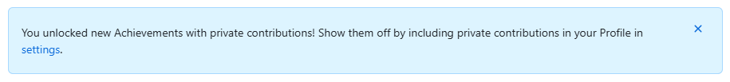

 

> You unlocked new Achievements with private contributions! Show them off by including private contributions in your Profile in settings.  
> 비공개 기여로 새로운 업적에 맞는 배지를 받을 조건이 충족되었다. 프로필 설정에서 비공개 기여를 포함하면, 새로운 업적을 프로필에 표시할 수 있다.
 

- [참고]
    - [획득할 수 있는 배지](https://github.com/Schweinepriester/github-profile-achievements)
    - [배지 숨기기](https://docs.github.com/en/account-and-profile/setting-up-and-managing-your-github-profile/managing-contribution-settings-on-your-profile/showing-your-private-contributions-and-achievements-on-your-profile)

 
 

## GitHub Profile Achievements

 

### 🎯 GitHub Achievements란?

GitHub Achievements는 특정 활동을 수행할 때 자동으로 부여되는 배지 시스템입니다. 예를 들어, 이슈를 빠르게 생성하거나(PR), 코드 리뷰를 활발히 수행하면 해당 업적에 해당하는 배지를 받을 수 있습니다.

기본적으로 GitHub 프로필에서 확인할 수 있으며, 활동이 많을수록 다양한 배지를 획득할 수 있습니다!

 

## 🏆 GitHub Achievements 확인하는 방법

### 1. 프로필에서 직접 확인하기

1. [GitHub](https://github.com/)에 로그인합니다.
2. 프로필 페이지로 이동합니다. (프로필 사진 클릭 → "Your profile" 선택)
3. 좌측 하단에서 "Achievements" 섹션 확인 (획득한 배지 확인)

### 2. 비공개 기여 포함하여 확인하기

비공개 저장소에서의 기여도 업적으로 반영할 수 있습니다. 하지만 기본적으로 비공개 활동은 프로필에 표시되지 않으므로, 별도의 설정이 필요합니다.

#### ✅ 설정 방법
1. [GitHub Profile Settings](https://github.com/settings/profile)로 이동합니다.
2. **"Include private contributions on my profile"** 옵션을 체크합니다.

3. 아래 버튼 `Update preferences` 클릭하여 변경 사항 저장하면, 비공개 기여도 업적에 반영됩니다!

 

## 🌟 대표적인 GitHub 배지 소개

GitHub에서 다양한 활동으로 획득할 수 있는 대표적인 배지!

| 배지 | 설명 |
|------|------|
| 🏅 **Quickdraw** | 빠르게 이슈(issue)나 PR을 생성하면 획득 |
| 🦈 **Pull Shark** | 여러 PR을 성공적으로 병합하면 획득 |
| 🧠 **Galaxy Brain** | 뛰어난 코드 리뷰를 제공하면 획득 |
| ⭐ **Starstruck** | 저장소가 많은 스타(★)를 받으면 획득 |

[모든 배지 확인은 여기서!](https://github.com/Schweinepriester/github-profile-achievements)

 

