<br/>


# Windows에서 Apache 단독 설치 방법 (XAMPP 없이)


## 🛠 **1. Apache 다운로드 및 설치**
Apache는 공식적으로 Windows용 바이너리를 제공하지 않으므로, **Apache Lounge**에서 다운로드해야 합니다.

### 🔗 Apache 다운로드
📌 **Apache Lounge 사이트:**  
👉 [https://www.apachelounge.com/download/](https://www.apachelounge.com/download/)
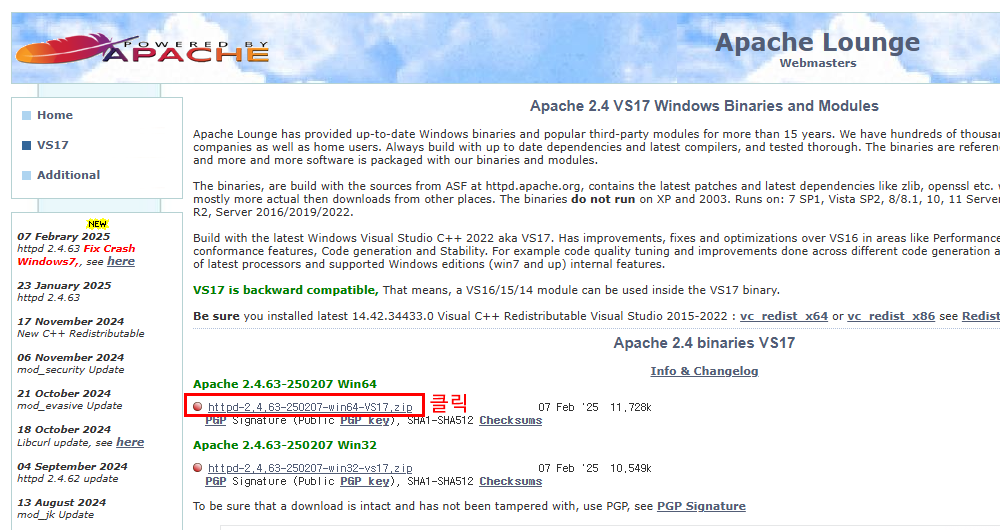

### ✅ **설치 방법**
1. 위 사이트에서 **"Apache 2.4 VCXX"** (VCXX는 최신 Visual Studio 버전) 버전을 다운로드.
2. `httpd-2.4.63-250207-win64-VS17.zip` 파일을 다운로드한 후 **압축 해제**
3. `C:\Apache24` 폴더를 생성한 후, 압축을 푼 파일을 이 폴더로 이동
4. `C:\Apache24\bin\httpd.exe` 파일이 Apache 실행 파일입니다.
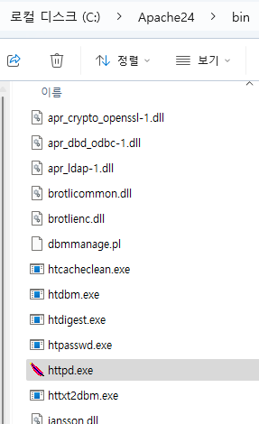{: width="512"}

---

## 🛠 **2. Apache 실행 및 환경 변수 설정**
Apache를 쉽게 실행하려면 환경 변수를 설정하는 것이 좋습니다.

### ✅ **환경 변수 설정**
1. **Windows 키 + R** → `sysdm.cpl` 입력 후 **Enter**.
2. **고급** 탭 → **환경 변수** 버튼 클릭.
3. **시스템 변수(SYSTEM variables) > Path** 선택 → **편집** 클릭.
4. **새로 만들기** 버튼을 클릭한 후 `C:\Apache24\bin` 추가.
5. **확인**을 눌러 저장

### ✅ **Apache 실행 방법**
환경 변수 설정 후 **명령 프롬프트(CMD)를 관리자 권한으로 실행**하고 아래 명령어를 입력:
```bash
httpd -k install
httpd -k start
```
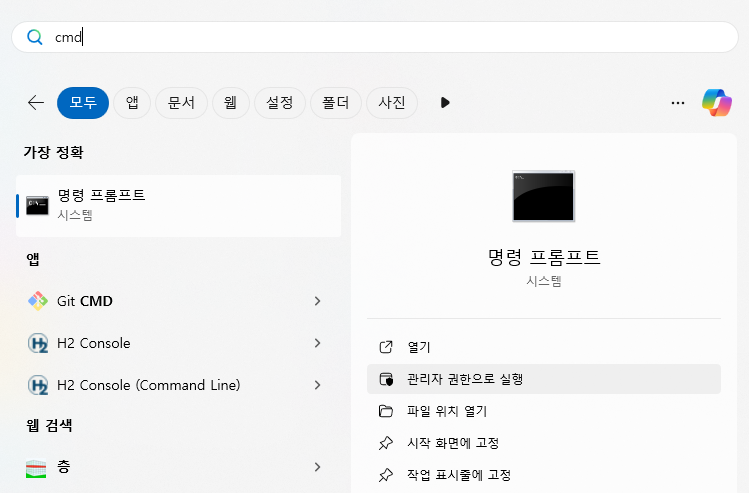
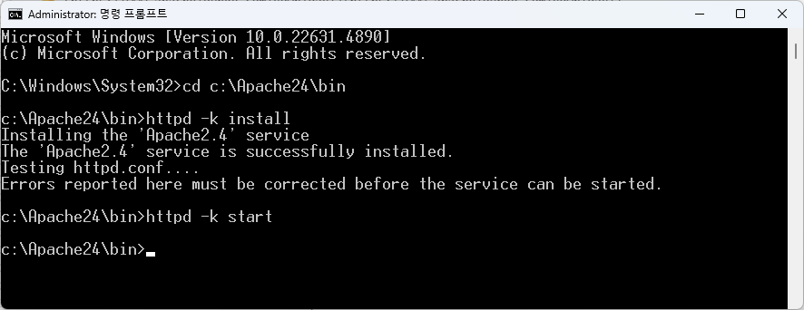


👉 실행이 성공하면 `http://localhost/` 접속 시 **Apache 기본 페이지**가 보여야 합니다.
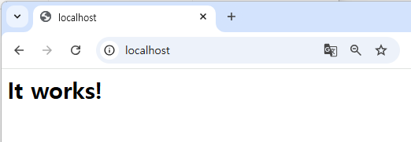

👉 중지하려면:
```bash
httpd -k stop
```
👉 제거하려면:
```bash
httpd -k uninstall
```

---

## 🛠 **3. Apache 포트 변경 (필요 시)**
기본적으로 **Apache는 80번 포트**를 사용하지만, Spring Boot가 8080을 쓰므로 필요하면 포트를 변경할 수 있습니다.

1. `C:\Apache24\conf\httpd.conf` 파일을 열기
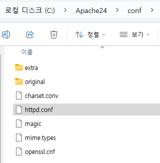

2. `Listen 80`을 찾고, `Listen 8081` (또는 원하는 포트)로 변경
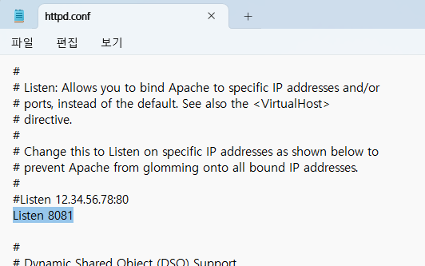

3. `#ServerName www.example.com:80`이 주석처리 되어 있음
`ServerName localhost:8081`으로 변경 (원하는 DNS, IP로 변경)
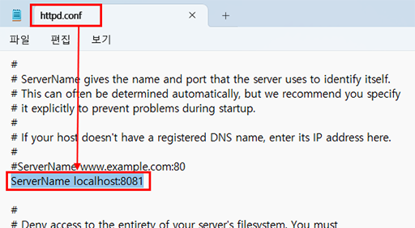

4. Apache 재시작:
   ```bash
   httpd -k restart
   ```
   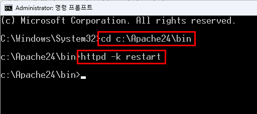

5. `http://localhost:8081/`로 접속하여 확인.
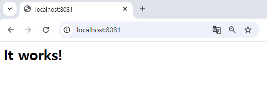


## 🛠 **4. PHP 설치 및 Apache 연동**
Apache만 설치하면 PHP가 실행되지 않으므로, PHP도 추가해야 합니다.

### 🔗 PHP 다운로드
📌 **PHP 공식 다운로드 사이트:**  
👉 [https://windows.php.net/download/](https://windows.php.net/download/)

### ✅ **설치 방법**
1. **Thread Safe (TS) 버전**의 `zip` 파일 다운로드
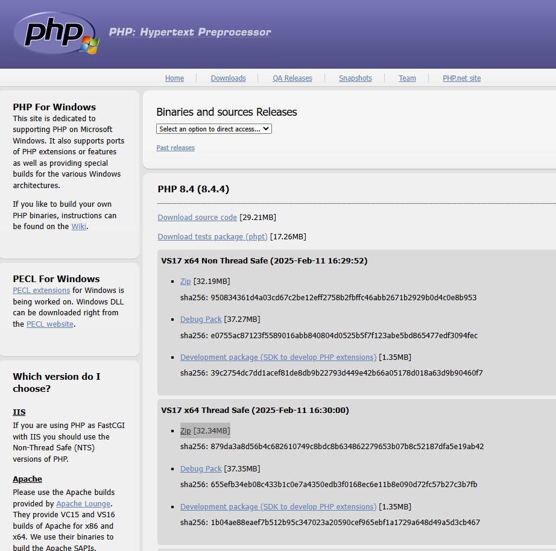

2. 압축 해제 후 `C:\php` 폴더에 이동
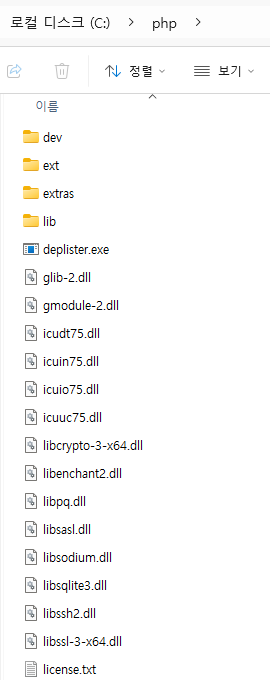

3. `C:\php\php.ini-development` 파일을 `php.ini`로 이름 변경
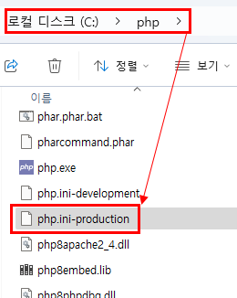
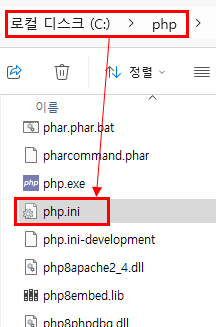

4. `C:\php` 폴더를 환경 변수에 추가

### ✅ **Apache와 PHP 연동**
1. `C:\Apache24\conf\httpd.conf` 파일을 열기
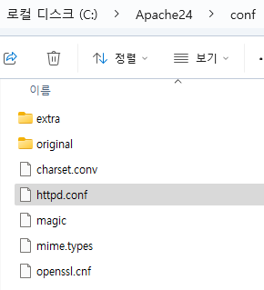

2. 아래 내용을 추가:
   ```conf
   LoadModule php_module "C:/php/php8apache2_4.dll"
   AddType application/x-httpd-php .php
   PHPIniDir "C:/php"
   ```
   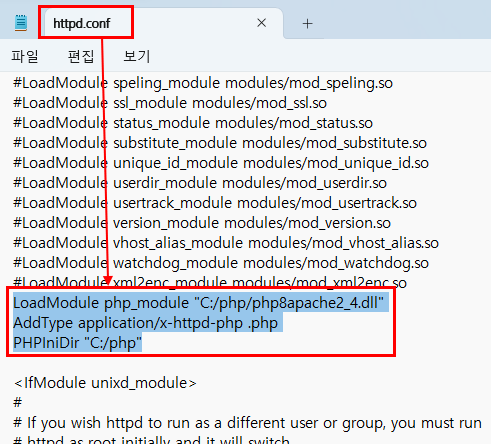

3. Apache 재시작:
   ```bash
   httpd -k restart
   ```
4. `C:\Apache24\htdocs\index.php` 파일을 만들어 아래 내용 입력:
   ```php
   <?php
   phpinfo();
   ?>
   ```
   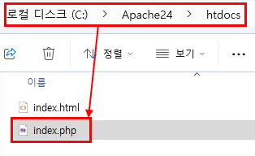

5. 브라우저에서 `http://localhost:8081/index.php` 접속하여 PHP 정보 페이지가 나오면 성공!
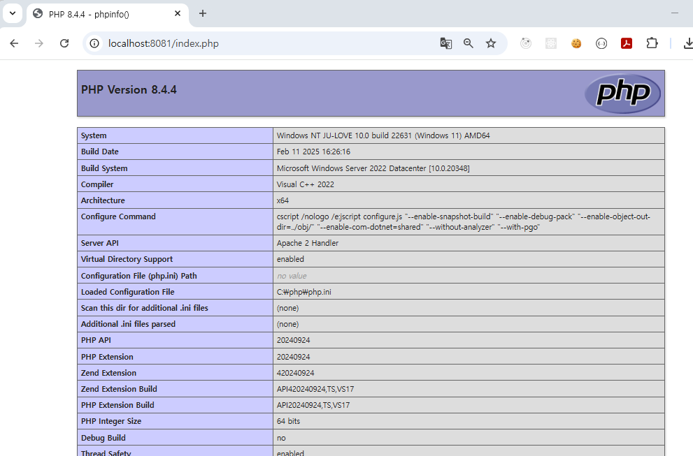

---

## 🛠 **5. Spring Boot + Apache 연동 (Reverse Proxy)**
Spring Boot 애플리케이션을 Apache를 통해 배포하려면 **Reverse Proxy 설정**을 추가해야 합니다.

1. `C:\Apache24\conf\httpd.conf` 파일을 열기

2. 아래 모듈들을 활성화: ```왼쪽에 # 삭제하여 주석 해제```
   ```conf
   LoadModule proxy_module modules/mod_proxy.so
   LoadModule proxy_http_module modules/mod_proxy_http.so
   ```
   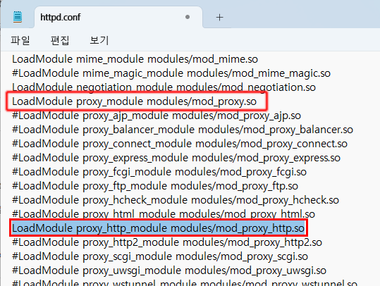

3. 다음 설정 추가 (Spring Boot가 8080에서 실행된다고 가정):
   ```conf
   <VirtualHost *:80>
       ServerName mydomain.com
       ProxyPass / http://localhost:8080/
       ProxyPassReverse / http://localhost:8080/
   </VirtualHost>
   ```
   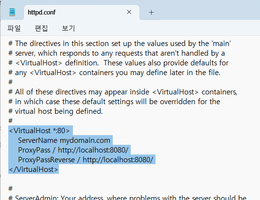

4. Apache 재시작:
   ```bash
   httpd -k restart
   ```

5. `http://localhost/`로 접속하면 Spring Boot 애플리케이션이 표시됩니다.
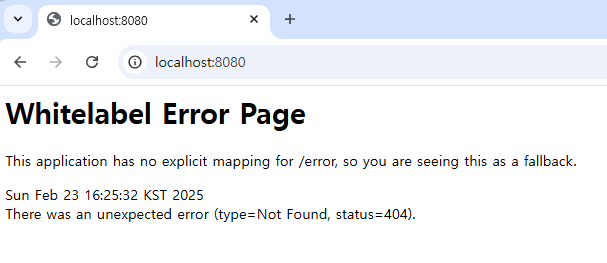

---

## 🎯 **정리: 설치 순서**
1. Apache 다운로드 및 설치 (Apache Lounge)
2. Apache 환경 변수 설정 및 실행
3. 필요 시 Apache 포트 변경 (`httpd.conf` 수정)
4. PHP 다운로드 및 설치
5. Apache + PHP 연동 (`httpd.conf` 수정)
6. Spring Boot + Apache 연동 (Reverse Proxy 설정)
