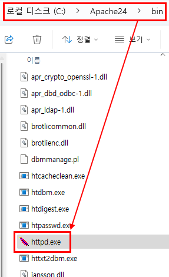
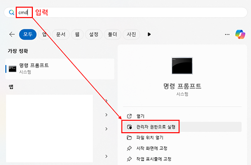
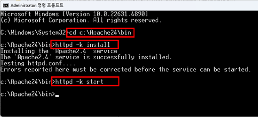
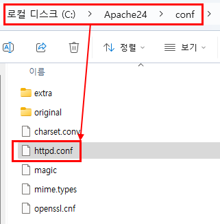
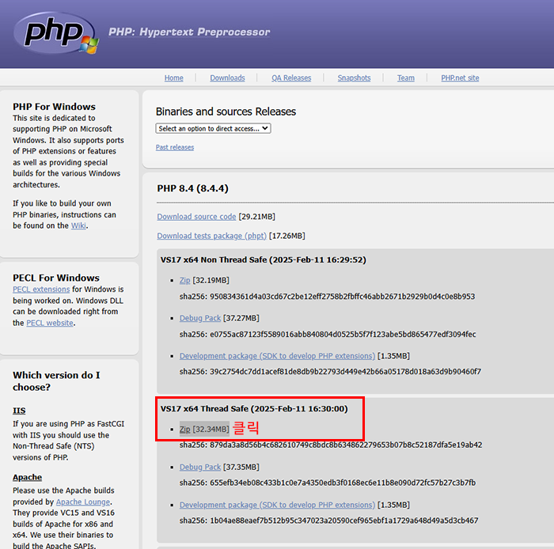
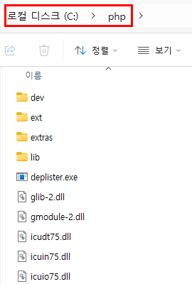
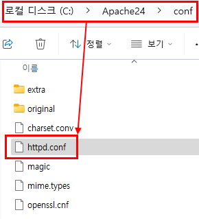
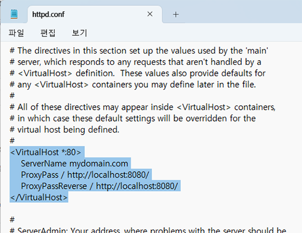
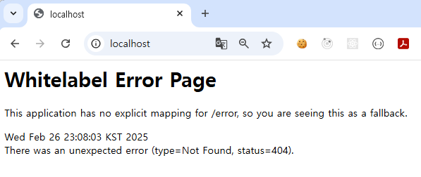
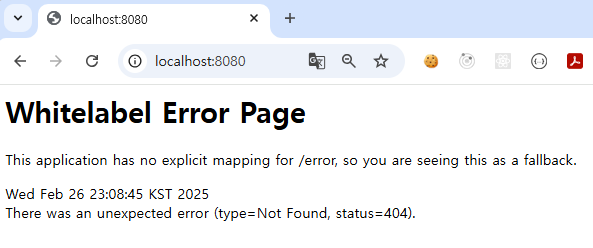

<br/>

# Windows에 Apache + PHP 설치하자!

<br/>

## **1. Apache 다운로드 및 설치**
Apache는 공식적으로 Windows용 바이너리를 제공하지 않으므로, **Apache Lounge**에서 다운로드해야 한다.

### ✅ Apache 다운로드
**🔗Apache Lounge 사이트:** [https://www.apachelounge.com/download/](https://www.apachelounge.com/download/)  


### ✅ **설치 방법**
1. 위 사이트에서 **"Apache 2.4 VCXX"** (VCXX는 최신 Visual Studio 버전) 버전을 다운로드  
2. `httpd-2.4.63-250207-win64-VS17.zip` 파일을 다운로드한 후 **`압축 해제`**  
3. 압축 푼 폴더 내 `Apache24` 폴더를 `C:\`로 이동  
4. `C:\Apache24\bin\httpd.exe` 파일이 Apache 실행 파일: `이 위치를 환경변수에 등록하기!`  
{: width="256" }


---

## **2. Apache 실행 및 환경 변수 설정**
Apache를 쉽게 실행하려면 환경 변수를 설정하는 것이 좋다.

### ✅ **환경 변수 설정**
1. **Windows 키 + R** → `sysdm.cpl` 입력 후 **Enter**  
2. `**고급**` 탭 → 우측 하단의 `**환경 변수**` 버튼 클릭  
3. 위에서 2번째 항목인 **시스템 변수(SYSTEM variables)** 에서 **Path**를 찾아 더블클릭    
4. **새로 만들기** 버튼을 클릭한 후 `C:\Apache24\bin` 추가  
5. **확인**을 눌러 저장  

### ✅ **Apache 실행 방법**
환경 변수 설정 후 **명령 프롬프트(CMD)를 `관리자 권한`으로 실행**하고 아래 명령어를 입력  
```bash
httpd -k install
httpd -k start
```  
* 윈도우키 누르고, cmd 입력  
   
* 명령어 차례로 입력  
    
* 실행이 성공하면 `http://localhost/` 접속 시 **Apache 기본 페이지**가 보임  
    
* Apache 중지  
   ```bash
   httpd -k stop
   ```
* Apache 설치 제거  
   ```bash
   httpd -k uninstall
   ```

---

## **3. Apache 포트 변경 (필수 사항 아님)**
- 기본적으로 **Apache는 80번 포트**를 사용하지만, Spring Boot가 8080을 쓰므로 필요하면 포트 변경가능   

1. `C:\Apache24\conf\httpd.conf` 파일을 열기  
  
2. `Listen 80`을 찾고, `Listen 8081` (또는 원하는 포트)로 변경  

3. `#ServerName www.example.com:80`이 주석처리 되어 있음  
`ServerName localhost:8081`으로 변경 (원하는 DNS, IP로 변경)  
  
4. Apache 재시작
```bash
httpd -k restart
```  
-   
5. `http://localhost:8081/`로 접속하여 확인  


---

## **4. PHP 설치 후, PHP와 Apache 연동**
Apache만 설치하면 PHP가 실행되지 않으므로, PHP도 추가한다.

### PHP 다운로드
📌 **PHP 공식 다운로드 사이트:** [https://windows.php.net/download/](https://windows.php.net/download/)  

### ✅ **설치 방법**  
1. **Thread Safe (TS) 버전**의 `zip` 파일 다운로드  
  
2. 압축 해제 후 `C:\php` 폴더에 이동  
  
3. `C:\php\php.ini-development` 파일을 `php.ini`로 이름 변경  
* 파일 이름 변경 전  
  
* 파일 이름 변경 후  
  
4. `C:\php` 폴더를 환경 변수에 추가

<br/>

### ✅ **Apache와 PHP 연동**
1. `C:\Apache24\conf\httpd.conf` 파일을 열기  
  
2. 아래 내용을 추가:
   ```conf
   LoadModule php_module "C:/php/php8apache2_4.dll"
   AddType application/x-httpd-php .php
   PHPIniDir "C:/php"
   ```  
   - 
3. Apache 재시작:
   ```bash
   httpd -k restart
   ```  
4. `C:\Apache24\htdocs\index.php` 파일을 만들어 아래 내용 입력  
   ```php
   <?php
   phpinfo();
   ?>
   ```  
   -   
5. 브라우저에서 `http://localhost:8081/index.php` 접속하여 PHP 정보 페이지가 나오면 성공!  
  

---

## **5. Spring Boot + Apache 연동 (Reverse Proxy)**
Spring Boot 애플리케이션을 Apache를 통해 배포하려면 `**Reverse Proxy 설정**`을 추가해야 한다.

1. `C:\Apache24\conf\httpd.conf` 파일을 열기

2. 아래 모듈들을 활성화: ```왼쪽에 # 삭제하여 주석 해제```
   ```conf
   LoadModule proxy_module modules/mod_proxy.so
   LoadModule proxy_http_module modules/mod_proxy_http.so
   ```  
-   

3. 다음 설정 추가 (Spring Boot가 8080에서 실행된다고 가정):  
   ```conf
   <VirtualHost *:80>
       ServerName mydomain.com
       ProxyPass / http://localhost:8080/
       ProxyPassReverse / http://localhost:8080/
   </VirtualHost>
   ```  
-   

4. Apache 재시작:  
   ```bash
   httpd -k restart
   ```  

5. `http://localhost/8081`로 접속하면 Spring Boot 애플리케이션이 표시된다.  
즉, Apache(`http://localhost/8081`)로 들어 온 요청을, Spring Boot(`http://localhost:8080`)로 전달  
그래서, 아래 이미지의 `http://localhost/8081`와 `http://localhost:8080`는 같은 페이지  
- **http://localhost/8081**  
  
- **http://localhost:8080**     
     

<br/><br/>

