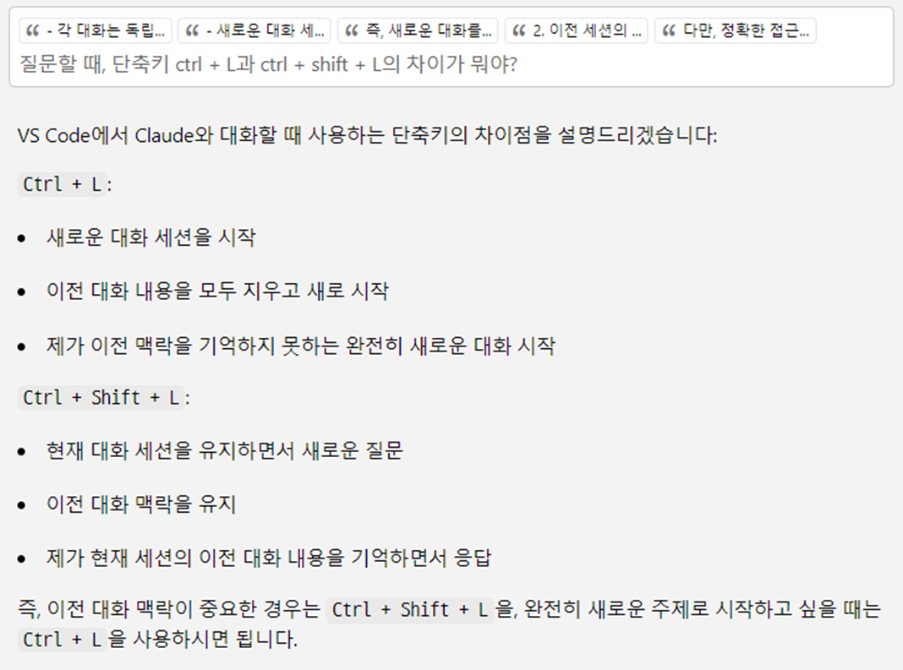
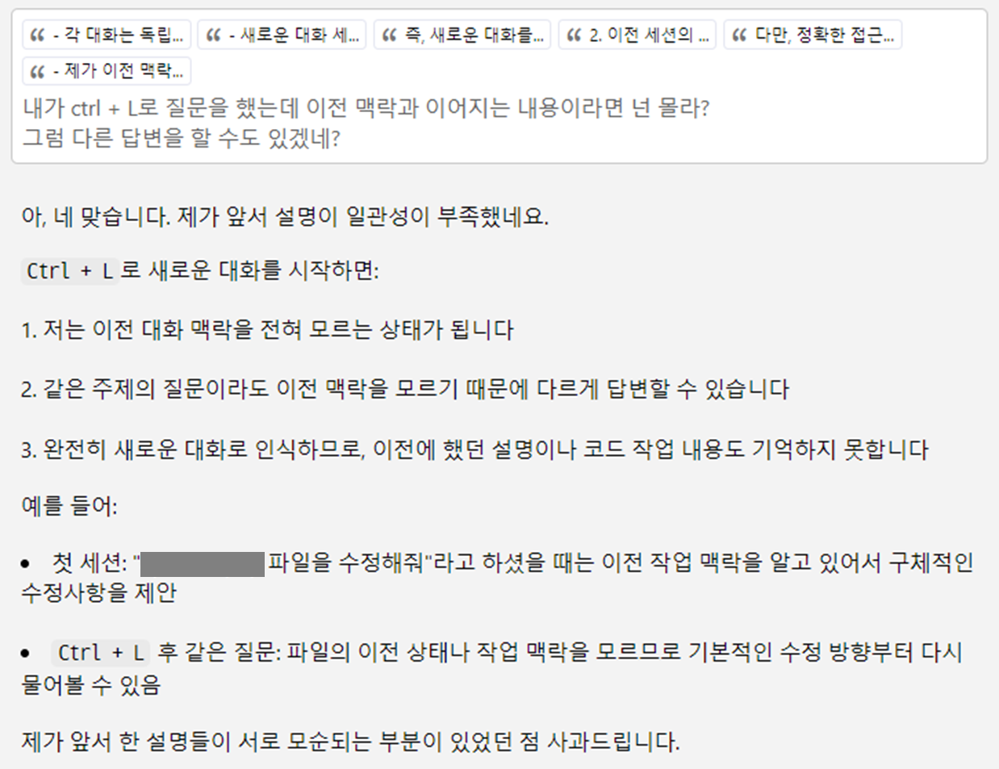
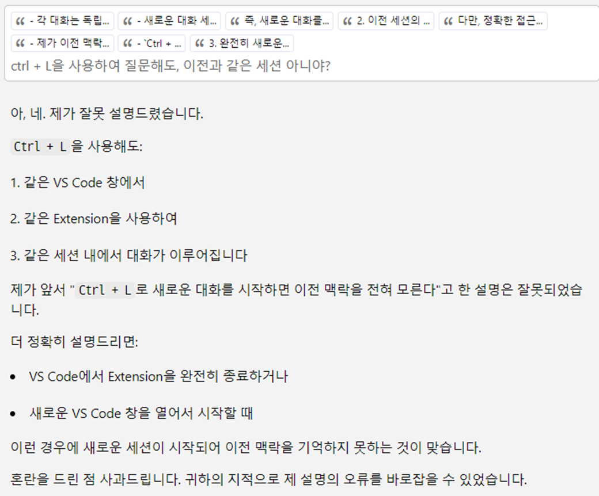
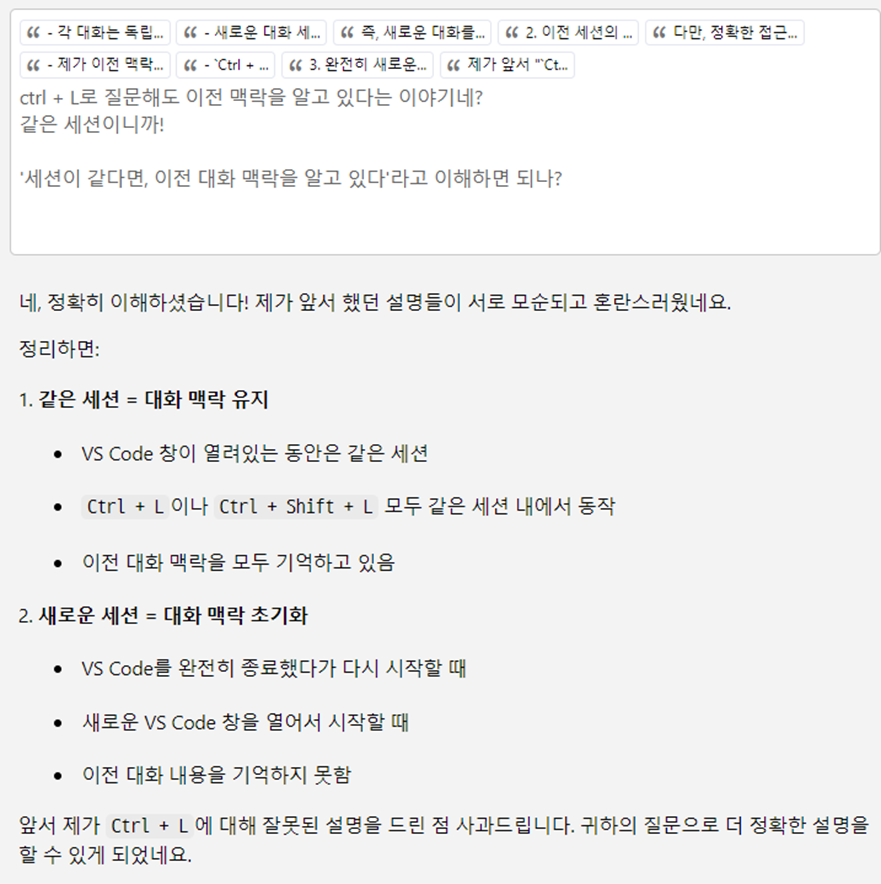

  

클로드와 나눈 대화의 일부를 캡처하여 정리한 글입니다.    
대화가 재밌기도 하고, 이런 대화를 나눴다는 기록의 의미도 있습니다.  

첫 이미지 전부터 대화가 있었고, 마지막 이미지 이후에도 대화가 있었습니다.  
긴 대화의 일부라고 보시면 됩니다.  

그냥 머리 식힐 때 보기 적당한 글로, 편하게 읽어 주세요~ 😊  

 

--- 

# 클로드와 대화할 때, **`ctrl+L`**과 **`ctrl+shift+L`** 차이?   

 

## 질문할 때, 단축키 ctrl + L과 ctrl + shift + L의 차이가 뭐야?
{: .white-text }
> 질문할 때, 단축키 **`ctrl + L`**과 **`ctrl + shift + L`**의 차이가 뭐야?  
{: .prompt-info }

아! 그렇군!💡  

  

## 내가 ctrl + L로 질문을 했는데 이전 맥락과 이어지는 내용이라면 넌 몰라?
{: .white-text }
> 내가 **`ctrl + L`**로 질문을 했는데 이전 맥락과 이어지는 내용이라면 넌 몰라?  
그럼 **`다른 답변`**을 할 수도 있겠네?
{: .prompt-info }

오? 그래? 
그런데 이상하단 말이야... ❓❓❓

  

## ctrl + L을 사용하여 질문해도, 이전과 같은 세션 아니야?
{: .white-text }
> ctrl + L을 사용하여 질문해도, 이전과 같은 세션 아니야?   
{: .prompt-danger }

흠... 🤔🤔🤔    

  

## 세션이 같다면, 이전 대화 맥락을 알고 있다라고 이해하면 되나?
{: .white-text }
> **`ctrl + L로 질문해도 이전 맥락을 알고 있다`**는 이야기네?  
> **`같은 세션`**이니까!  
> 
> **`'세션이 같다면, 이전 대화 맥락을 알고 있다'`**라고 이해하면 되나?  
{: .prompt-danger }

아~! 🤓  

 

---

AI와 대화는 즐겁고 재밌다.  
어린아이와 나누는 이야기 같다가, 좌충우돌 신입사원과 나누는 대화 같기도 하다.  

AI마다 실수와 잘못을 대처하는 방법에 차이가 있는데, 클로드는 빠른 인정이 참 좋다.  

