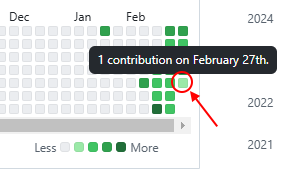
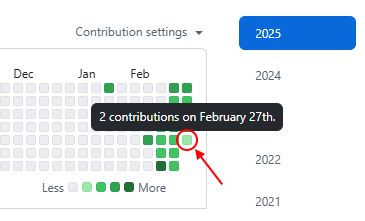
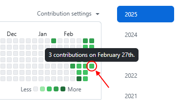
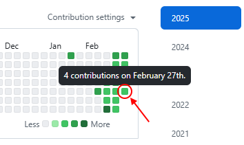
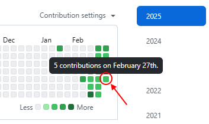
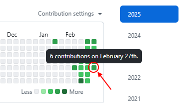
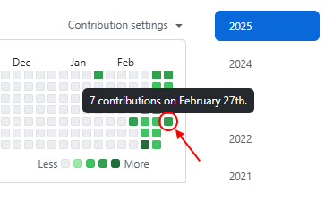
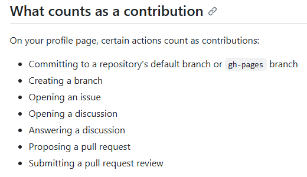

  
# 커밋을 얼마나 해야 잔디색이 변할까? (커밋 횟수 기준)
 

> 잔디는 회색을 제외하고 색이 4개 있다.  
- 
  -  : 0단계 (아무 것도 하지 않은 상태)
  -  : 1단계 (커밋 횟수: 1~2)
  -  : 2단계 (커밋 횟수: 3~5)
  -  : 3단계 (커밋 횟수: 6~9)
  -  : 4단계 (커밋 횟수: 10~)
{: .prompt-info }

 

---

##  1단계

### 🌿 커밋 횟수 : 1  
- 

### 🌿🌿 커밋 횟수 : 2  
-   

 

---

##  2단계 

### 🌿🌿🌿 커밋 횟수 : 3  
- 

### 🌿🌿🌿🌿 커밋 횟수 : 4  
- 

### 🌿🌿🌿🌿🌿 커밋 횟수 : 5  
- 

 

---

##  3단계 

### 🌿🌿🌿🌿🌿🌿 커밋 횟수 : 6  
- 

### 🌿🌿🌿🌿🌿🌿🌿 커밋 횟수 : 7  
- 

 

나머지는 다음에...  
미처 캡처를 못 했습니다. 🥹  

 

기여에 커밋 외 무엇이 있는지 확인하세요.  
  {: target="_blank" }

  

우리 열심히 잔디 심어요~ 🌿😊  

