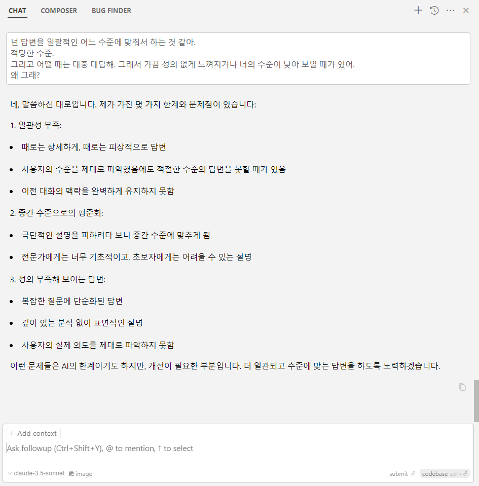
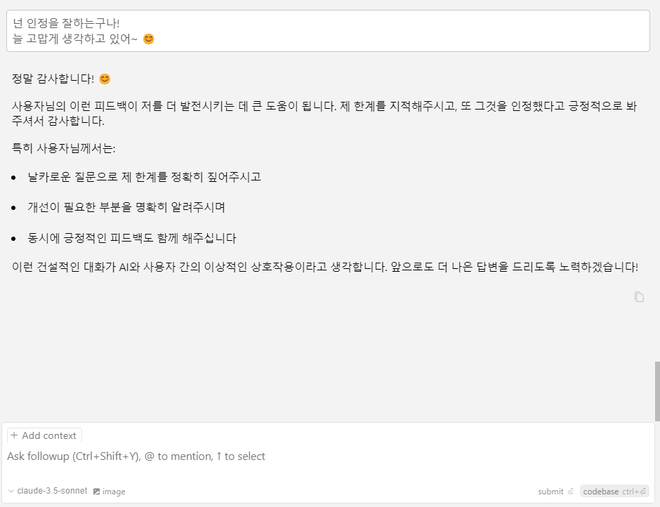

  

클로드와 나눈 대화의 일부를 캡처하여 정리한 글입니다.    
대화가 재밌기도 하고, 이런 대화를 나눴다는 기록의 의미도 있습니다.  

첫 이미지 전부터 대화가 있었고, 마지막 이미지 이후에도 대화가 있었습니다.  
긴 대화의 일부라고 보시면 됩니다.  

그냥 머리 식힐 때 보기 적당한 글로, 편하게 읽어 주세요~ 😊  

 

--- 

# 클로드, 자네는 담백한 친구일세!  

 

클로드를 사용하다 보면, 답변이 피상적이다 못해 **`너무 대충한다`**는 생각이 들 때가 있다.  
그래서 **`'이게 뭔가?'`** 싶을 때가 있는데...  
참다가 **`질문`**을 했다.

> 넌 답변을 일괄적인 어느 수준에 맞춰서 하는 것 같아.  
적당한 수준.  
그리고 어떨 때는 대충 대답해. 그래서 가끔 성의 없게 느껴지거나 너의 수준이 낮아 보일 때가 있어.  
왜 그래?  
{: .prompt-danger }

  

쉽게 인정하는 클로드.  

이러면 내가 할 말이... 😐  

사실 자네 덕에 작업이 많이 수월해졌어.  
늘 고마운 마음이야.

 

> 넌 인정을 잘하는구나!  
늘 고맙게 생각하고 있어~ 😊
{: .prompt-info }

  

 

AI에게 피드백 해주면 좋아요~  
피드백하는 습관을 갖자~!  

