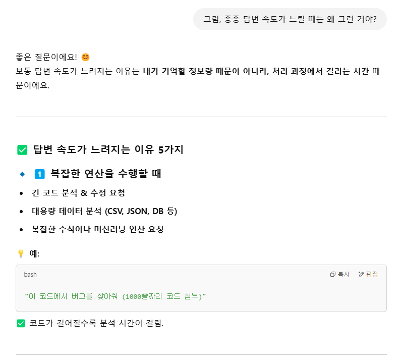

  

ChatGPT-4o와 나눈 대화의 일부를 캡처하여 정리한 글입니다.    
대화가 재밌기도 하고, 이런 대화를 나눴다는 기록의 의미도 있습니다.  

첫 이미지 전부터 대화가 있었고, 마지막 이미지 이후에도 대화가 있었습니다.  
긴 대화의 일부라고 보시면 됩니다.  

그냥 머리 식힐 때 보기 적당한 글로, 편하게 읽어 주세요~ 😊  

 

--- 

# 대화가 길어지면 답변이 느려질까?

 

GPT와 대화 중에 답변이 느릴 때가 종종 있다.  
혹시... 창 하나에 많은 질문을 해서, 답변이 느려진걸까?  
왜 답변이 느린거야? 궁금하니까, 질문했다!  

## 네가 기억해야 하는 정보량이 많아지면, 네 답변이 점점 느려져?
{: .white-text }
> 궁금한 점이 있어.  
내가 현재 창에서 질문을 꽤 많이 했잖아?  
그럼 네가 기억해야 하는 정보량이 많아지고...  
이러한 상황이면, 네 답변이 점점 느려져?   
{: .prompt-info }

{: .w-80 }  
{: .w-80 }  

🌿 
🌿 
🌿 
🌿 
🌿 

그렇군!  
그런데 왜 답변이 느릴 때가 있는거야? 🤔❓  

## 그럼, 종종 답변 속도가 느릴 때는 왜 그런 거야?
{: .white-text }
> 그럼, 종종 답변 속도가 느릴 때는 왜 그런 거야?
{: .prompt-info }

{: .w-80 }  
{: .w-80 }  
{: .w-80 }  
{: .w-80 }  

🌿 
🌿 
🌿 
🌿 
🌿 

**답변과 내 상황과 다른데???** 🤔❓    

## 그런데 내 질문은 위 1, 2, 3, 4에 해당되지 않는데, 답변이 느릴 때가 있거든.
{: .white-text }
> 그런데 내 질문은 위 1, 2, 3, 4에 해당되지 않는데, 답변이 느릴 때가 있거든.  
그건 왜 그래?  
{: .prompt-info }

{: .w-80 }  
{: .w-80 }  
{: .w-80 }  
{: .w-80 }  

🌿 
🌿 
🌿 
🌿 
🌿 

**답변의 질문은 내 스타일이 아닌데....**
**그리고 답변이 뭔가 심심하단 말이야! 🤔**  

## 만약, 네가 한번도 받아 보지 못한 질문일 경우에는?
{: .white-text }
> 만약, 네가 한번도 받아 보지 못한 질문일 경우에는?  
이런 경우에도 답변이 느리지 않을까?  
{: .prompt-info }

{: .w-80 }  
{: .w-80 }  
{: .w-80 }  
{: .w-80 }  

🌿 
🌿 
🌿 
🌿 
🌿 

그랬구나~! 🤓  
 

