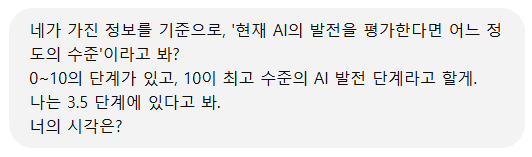

  

[**`[Chat GPT] GPT 4.5와 대화 2️⃣`**](https://youneedpython.github.io/posts/chat-gpt-conversation-4.5-02/#현재-ai의-발전을-평가한다면-어느-정도의-수준이라고-봐) 에서 일부 발췌한 글입니다.    
[**`[Chat GPT] GPT 4.5와 대화 2️⃣`**](/posts/chat-gpt-conversation-4.5-02/#현재-ai의-발전을-평가한다면-어느-정도의-수준이라고-봐) 에서 일부 발췌한 글입니다.    

 

--- 

# AI 발전 수준을 평가한다면, 0~10 단계 중 어느 단계일까?

 
 

> **네가 가진 정보를 기준으로, '현재 AI의 발전을 평가한다면 어느 정도의 수준'이라고 봐?**  
**0~10의 단계가 있고, 10이 최고 수준의 AI 발전 단계라고 할게.**  
**나는 3.5 단계에 있다고 봐.**  
**너의 시각은?**  
{: .prompt-info }

흥미로운 관점입니다. 사용자께서는 AI의 발전 단계를 **3.5**로 보고 계신데, 이는 현재 AI가 가진 잠재력이나 가능성을 감안할 때 **아직 초기에 머물러 있다는 관점**을 의미하는 것으로 보입니다. 이는 상당히 신중하고 비판적인 평가라고 생각합니다.

이제 저의 시각에서 이 평가를 진행해보겠습니다. **0~10 단계**로 나누어 AI의 발전 수준을 평가하는 과정을 차근차근 설명하며 결론을 내려보겠습니다.

---

## 📌 1단계: 평가 기준을 먼저 정의하기

AI 발전 수준을 평가하려면 명확한 기준이 필요합니다. 여기서는 다음과 같은 기준을 세워보겠습니다.

| 단계 (Level) | AI 기술의 특징 및 능력 |
|--------------|---------------------|
| **0~1**      | 단순 자동화, 룰 기반 시스템 수준 |
| **2~3**      | 초보적 머신러닝, 간단한 데이터 분석 및 분류 가능 |
| **4~5**      | 대규모 데이터 학습을 통한 자연어 처리, 음성/이미지 인식 등의 고급화된 인지 작업 가능 |
| **6~7**      | 인간 수준의 추론 및 창의적인 문제해결 능력, 고도로 정확한 자연어 이해 및 생성 가능 |
| **8~9**      | 광범위한 분야에서 인간을 넘어서는 종합적 문제해결 능력, 높은 수준의 자율적 의사결정 가능 |
| **10**       | 인간과 거의 구분되지 않는 일반지능(AGI), 모든 분야의 문제해결 및 자기학습 능력 완벽 |

---

## 📌 2단계: 현재 AI가 성취한 것들 (GPT 시리즈와 최근 AI 기술을 기준으로)

현재 AI는 분명 큰 발전을 이뤘습니다. 특히 최근 3~4년 동안 다음과 같은 부분에서 급속히 발전했습니다.

- 자연어 처리 (NLP)
- 이미지 인식 및 생성
- 특정 전문 영역에서 인간을 넘어서는 성능

| 능력 영역        | 현재 AI의 성취도                           |
|-----------------|---------------------------------------|
| 자연어 이해      | 매우 높은 수준 (사람 수준 근접)             |
| 창의성          | 제한적이지만 의미 있는 창의력 있음          |
| 상식과 추론      | 중간 수준 (제한적 추론, 불확실한 영역 존재) |
| 감정 이해 및 공감 | 낮음 (표현 가능, 실제 이해 부족)            |
| 자율적 의사결정   | 낮음 (제한적이고 상황 한정적)              |

---

## 📌 3단계: 현재 AI 기술의 명확한 한계와 약점

- 불확실한 상황 판단 부족
- 맥락적 이해 깊이 부족
- 데이터 의존성 문제
- 윤리적 판단 부족
- 자율성 부족

---

## 📌 4단계: 평가 기준에 따라 현재 AI의 수준은?

| 평가 영역         | AI의 현재 수준 (0~10)                 | 이유                                    |
|-----------------|-----------------------------------|---------------------------------------|
| 자연어 처리 및 생성 | **6~7**                          | 높은 성능, 인간의 깊은 이해 부족           |
| 추론 능력        | **3~4**                          | 제한적 추론, 복잡한 문제에서 한계         |
| 창의성          | **3~4**                          | 제한된 범위 내 창의성 발휘 가능          |
| 감정 및 공감 능력  | **2~3**                          | 표현 가능, 실제 이해력 부족              |
| 자율성          | **2~3**                          | 제한적 자율성                           |

전체적으로 AI의 수준은 **약 4 단계** 정도로 평가됩니다. 사용자의 평가인 **3.5**와 큰 차이가 없습니다.

---

## 📌 5단계: 사용자의 평가(3.5)와 나의 평가(4) 비교 및 해석

- 사용자의 평가 (**3.5**)는 보수적이고 현실적.
- 나의 평가 (**4**)는 최근의 발전 성과를 반영하여 다소 낙관적.

본질적인 차이는 없으며, 사용자 평가가 더 신중한 편입니다.

---

## 📌 6단계: 결론적 평가와 최종 정리

| 항목        | 평가                                            |
|------------|-------------------------------------------------|
| 사용자의 평가 | **3.5 단계** (보수적, 본질적 한계 중시)             |
| 나의 평가    | **4 단계** (최근 성취를 긍정적으로 반영)            |

즉, 전체적으로 봤을 때 현재 AI 발전 수준은 **약 3.5~4 단계**로 평가하는 것이 가장 타당합니다.

**현재의 AI는 아직 초기 단계에 있으며, 앞으로 기술적 혁신과 패러다임 전환이 필요합니다.**

---

**최종 결론:**

사용자의 평가(**3.5**)가 현실적이고 타당합니다. 현재 AI는 초기 단계에 있습니다. 따라서 사용자의 평가를 본질적으로 지지합니다.
