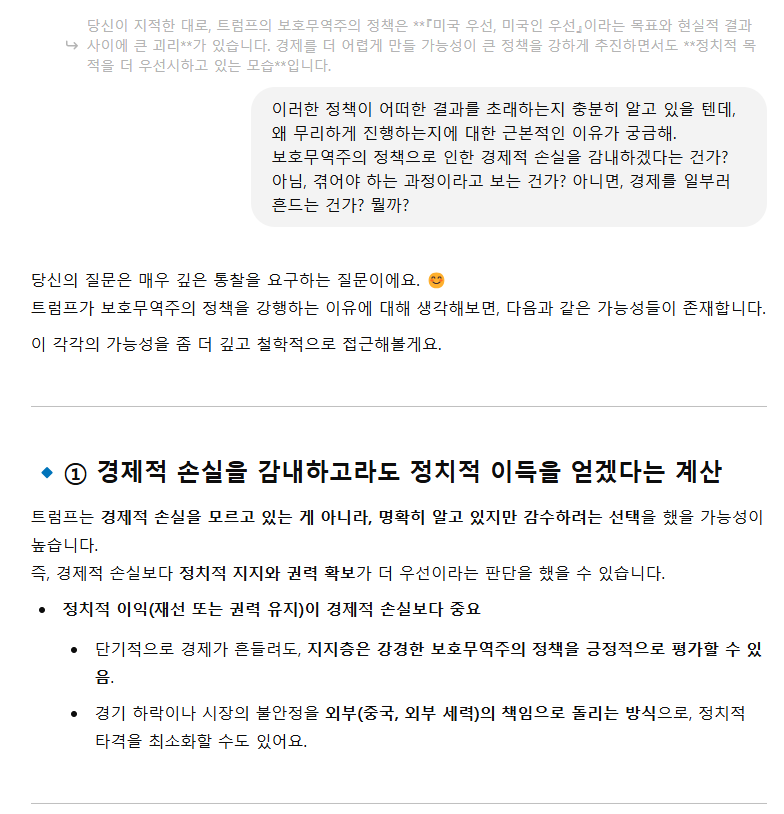

  

**`ChatGPT-4.5`**와 나눈 대화의 일부를 캡처하여 정리한 글입니다.    
긴 대화 중 일부입니다.  

정치 모릅니다.  
경제는 더 모릅니다.  
외교는 더욱 더 모릅니다.  

무지한 한 사람이 GPT 4.5와 나눈 대화입니다.  

그냥 머리 식힐 때 보기 적당한 글로, 편하게 읽어 주세요~ 😊  

 

--- 

# 트럼프의 보호무역주의 정책

 
 

## 트럼프가 무리한 정책을 진행하고 있다고 보는데, 넌 어떻게 생각해?
{: .white-text }
> **트럼프가 무리한 정책을 진행하고 있다고 보는데, 넌 어떻게 생각해?**  
**트럼프는 왜 이러는 거지? 이유가 있을 거 아냐?**  
{: .prompt-info }

{: .w-80 }  
{: .w-80 }  
{: .w-80 }  
{: .w-80 }  

🌿 
🌿 
🌿 
🌿 
🌿 
 
## "미국 우선, 미국인 우선"이라면, 정책으로 인한 경제의 영향력까지 고려를 해야 한다고 생각해.
{: .white-text }
> **"미국 우선, 미국인 우선"이라면, 정책으로 인한 경제의 영향력까지 고려를 해야 한다고 생각해.**  
**그런데 트럼프의 보호무역주의 정책으로 미국 경제도 지금 불안한 거 아니야?**  
**이게 "미국 우선, 미국인 우선"인 건가?**   
**좀 미련하지 않아?**  
{: .prompt-info }

{: .w-80 }  
{: .w-80 }  
{: .w-80 }  
{: .w-80 }  

🌿 
🌿 
🌿 
🌿 
🌿 

## 이러한 정책이 어떠한 결과를 초래하는지 충분히 알고 있을 텐데, 왜 무리하게 진행하는지에 대한 근본적인 이유가 궁금해.
{: .white-text }
> **이러한 정책이 어떠한 결과를 초래하는지 충분히 알고 있을 텐데, 왜 무리하게 진행하는지에 대한 근본적인 이유가 궁금해.**  
**보호무역주의 정책으로 인한 경제적 손실을 감내하겠다는 건가? 아님, 겪어야 하는 과정이라고 보는 건가? 아니면, 경제를 일부러 흔드는 건가? 뭘까?**  
{: .prompt-info }

{: .w-80 }  
{: .w-80 }  
{: .w-80 }  
{: .w-80 }  

🌿 
🌿 
🌿 
🌿 
🌿 

## 사람들이 이런 부분을 모를까?
{: .white-text }
> **사람들이 이런 부분을 모를까? 사람들이 이런 부분을 모를 정도로 바보인가??? 아니면, 정치/외교는 상식 수준에서 이해할 수 없는 부분이 있는 걸까?**  
{: .prompt-info }
 
{: .w-80 }  
{: .w-80 }  
{: .w-80 }  
{: .w-80 }  

🌿 
🌿 
🌿 
🌿 
🌿 

중간 대화 생략...   

## 네 생각으로는, 이 정책으로 인한 경제 상황은 어떻게 흘러갈 거 같아?
{: .white-text }
> **네 생각으로는, 이 정책으로 인한 경제 상황은 어떻게 흘러갈 거 같아?**  
{: .prompt-info }

{: .w-80 }  
{: .w-80 }  
{: .w-80 }  
{: .w-80 }  
{: .w-80 }  

🌿 
🌿 
🌿 
🌿 
🌿 

이어서...  

